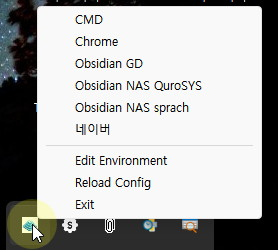

# QikMenu (quick-menu-launcher)
[English](README.md) | [한국어](README_KO.md) | **日本語**

Rustで作成された軽量なWindowsシステムトレイアプリケーションです。INIファイルに定義されたメニューから、よく使うアプリケーションやウェブサイトを素早く起動できます。

## 開発の背景
このアプリは、以下のニーズを満たすために作成されました。
- **Obsidian Vaultの管理**: 用途ごとに分かれたObsidianの保管庫（Vault）を、必要な時に簡単に選択して開きたいと考えました。
- **携帯性の確保**: 普段はStream Deckにショートカットを登録して使用していますが、デバイスを持ち運べない環境でも、システムトレイから同様の機能を使いたいと思いました。
- **タスクバーの整理**: Windowsのタスクバーをそのまま使いつつ、特定のアプリをグループ化して、すっきりと管理・実行したいと考えました。
- **汎用性の拡張**: 実装の過程で、Obsidianだけでなく、他のよく使うアプリも簡単に登録して呼び出せるように機能を拡張しました。

## ダウンロード
以下のリンクから最新バージョンをダウンロードしてください。
- [QikMenu ダウンロード](refs/downloads/QikMenu-251208b.7z)

## インストールと実行方法
1. ダウンロードした `7z` ファイルを任意のフォルダに解凍します。
2. `QikMenu.exe` があることを確認します。
3. 同じフォルダに `QikMenu.ini` 設定ファイルがあることを確認します。
4. `QikMenu.exe` をダブルクリックして実行します。

## 使い方
プログラムが実行されると、Windowsタスクバーのシステムトレイ領域（右下）にアイコンが表示されます。



1.  **メニューを開く**: トレイアイコンをクリック（左/右どちらでも可）すると、上記のようなメニューが表示されます。
2.  **プログラム起動**: リストから項目をクリックすると、対応するアプリケーションやウェブサイトが起動します。
3.  **環境設定の編集**:
    - メニュー下部の **「環境編集」** をクリックします。
    - `QikMenu.ini` ファイルがメモ帳（または標準エディタ）で開かれます。
    - 項目の追加や修正を行います（下記の設定セクションを参照）。
    - ファイルを保存して閉じます。
4.  **設定の適用 (再読み込み)**:
    - 設定を保存した後、メニューの **「設定再読み込み」** をクリックします。
    - アプリを再起動しなくても、変更内容が即座にメニューに反映されます。
5.  **終了**: メニューの **「終了」** をクリックすると、プログラムが完全に終了します。

## Windows起動時の自動実行
Windows起動時にこのプログラムを自動的に実行するには：

1. キーボードの `Win` キー + `R` キーを押して、**ファイル名を指定して実行** ウィンドウを開きます。
2. `shell:startup` と入力して OK を押します。**スタートアップ** フォルダが開きます。
3. `QikMenu.exe` の **ショートカット** を作成します。
4. 作成した **ショートカット** を、先ほど開いた **スタートアップ** フォルダにコピーまたは移動します。
5. これで、Windows起動時にプログラムが自動的に実行されます。

## 設定ファイル (`QikMenu.ini`)
```ini
[global]
# 利用可能な言語: ja (日本語), en (英語), ko (韓国語)
locale=ja

[apps]
# 形式: 表示名=コマンド
# Obsidian
Obsidian MyVault1=obsidian://open/?vault=MyWorks1
Obsidian MyVault2=obsidian://open/?vault=MyWorks2
Obsidian MyVault3=obsidian://open/?vault=MyWorks3
# その他
コマンドプロンプト=cmd
Google=https://google.co.jp
メモ帳=notepad.exe
```
